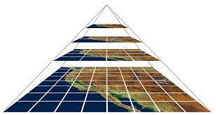

********************************************
Create basemaps for webmapping projects
********************************************

Base Cartography
=====================

Most of *webmapping* applications use base cartography to contextualize represented data.
The source of this base maps is very diverse, and despite we can also generate ourselves this data, the most usual is to use different providers.

Some of this providers are:

- OpenStreetMap (https://www.openstreetmap.org)
- Google Maps
- Mapbox (https://www.mapbox.com/maps)
- OpenMapTiles (https://openmaptiles.org/)
- ICGC (https://openicgc.github.io/)
- Stamen (http://maps.stamen.com/#toner/12/37.7706/-122.3782)
- etc

Some of this services are not free, or may be offered for free but with limits.
We should take this in considerations and, according to our site visits, we'll have to contract the services.

We can also choose one specific provider according to the predefined styles offered, if they are on the line of our application.
Some examples:

Midimapping: https://sigserver4.udg.edu/apps/midimapping

Mosquito Alert: http://www.mosquitoalert.com/ca/

.. note::
   The process to generate our own base cartography for a webmapp application, means:

   a) Dispose of the reference Cartography
   b) Apply the corresponding styles
   c) Allocate the datasets
   d) Optimally serve the cartography

Vector Tiles vs Raster Tiles
=============================

Actually (and leaving out the OGC services) there are basically two ways to generate base maps: Vector Tiles and Raster Tiles.

Using raster tiles, the map is not stored in a single image. Small regular tiles are **pregenerated** for each zoom level, and are combined to form the entier map.
In this way, only a small fraction of a large set of data is served to the user, guaranteeing a better speed in the delivery of data on a web environment.

On the other side, in vector tiles, the styles are rendered on the client browser (they are not pregenerated). Offer an inifity zoom capacity, and as vector data is available on the client, maps can be represented with a lot of resolution.
Also the client has acces to he information of geographic objects (attributs and geometry), as are not images, but vector entities.

Initializing a web mapping project
==================================

We are going to use the OpenLayers library: https://openlayers.org

.. note::
   Leaflet and OpenLayers allow Vector Tiles and Raster Tiles layers. But Leaflet doesn't incorporates the capacity to interpret styles generated with the **Vector Tile GL** Mapbox specification, and must be created according to the library specification, which doesn't allows to integrate a style generated with ContextMaps (ICGC) or Mapbox.

In order to work on an OpenLayers Project, it's recomended to use **Node.js**.

Working with Node offer's some advantages:

1. Work with modules, so it's not necessary to load all the library.
2. Offer's a local development server.
3. Used by the OpenLayers demonstration page.

Follow this instructions to initialize an OpenLayers project with NOde:

.. code-block:: console

  mkdir mapa
  cd mapa
  npx create-ol-app
  npm start

This will automatically create the aplication, separating the html, js and css files. Open this files with a code editor as Atom or VisualStudio and inspect them.
To visualize the map, just copy the url on a browser.

Adding layers to map
=====================

We can add multiple layers to OpenLayers. For example, a marker, and apply later a style to it. Use the following code:

.. code-block:: javascript

  import './style.css';
  import {Map, View} from 'ol';
  import TileLayer from 'ol/layer/Tile';
  import OSM from 'ol/source/OSM';
  import Style from 'ol/style/Style';
  import Stroke from 'ol/style/Stroke';
  import Fill from 'ol/style/Fill';
  import Circle from 'ol/geom/Circle';
  import CircleStyle from 'ol/style/Circle';
  import VectorLayer from 'ol/layer/Vector';
  import VectorSource from 'ol/source/Vector';
  import Point from 'ol/geom/Point';
  import Feature from 'ol/Feature';
  import * as olProj from 'ol/proj';

  const map = new Map({
    target: 'map',
    layers: [
      new TileLayer({
        source: new OSM()
      })
    ],
    view: new View({
      center: [0, 0],
      zoom: 2
    })
  });

  var markerStyle = new Style({
    image: new CircleStyle({
      fill: new Fill({
        color: 'red'
      }),
      stroke: new Stroke({
        color: 'yellow'
      }),
      radius: 10
    })
  });

  var layer = new VectorLayer({
    source: new VectorSource({
       features: [
           new Feature({
               geometry: new Point(new olProj.fromLonLat([2.8, 41.9]))
           })
       ]
    }),
    style: markerStyle

  });
  map.addLayer(layer);

Adding interaction
====================

In order to add interaction, for example, when selecting the marker, import ``Select`` and ``click``:

.. code-block:: javascript

  import Select from 'ol/interaction/Select';
  import {click} from 'ol/events/condition';

And, at the end of the document, add the interaction:

.. code-block:: javascript

  // Interaction
  var selectInteraction = new Select({
    condition: click,
    layers: [layer],
    style: markerStyle
  });

  selectInteraction.on('select', function (evt) {
    alert('click over marker');
    // clear the selection to allow select again later
    this.getFeatures().clear();
  });

  map.addInteraction(selectInteraction);

Mapbox Base Layers (Raster Tiles)
=================================

There are lots of predefined styles at Mapbox ready to use as base cartography for your webmapp applications.

In order to use this styles, is necessary a **Token**, that can be obtained after register to the Mapbox website. When logged to the platform, create a Token and use the **Default public token**.

The javascript code to create a variable with the XYZ openlayers constructor is:

.. code-block:: javascript

  // import XYZ
  import XYZ from 'ol/source/XYZ';

  var mapboxLayer = new XYZ({
    attributions: 'mapbox',
    url: 'https://api.mapbox.com/styles/v1/mapbox/streets-v11/tiles/256/{z}/{x}/{y}?access_token=yourToken',
    maxZoom: 20,
    crossOrigin: '',
  });

And change, on the *map* variable, the reference to the layer:

.. code-block:: javascript

  const map = new Map({
    target: 'map',
    layers: [
      /*
      new TileLayer({
        source: new OSM()
      })
      */
      new TileLayer({
        source:mapboxLayer
      })
    ],
    view: new View({
      center: [0, 0],
      zoom: 2
    })
  });

In this example, we are using the **streets-v11** Mapbox layer. But we cal use others, as *light*

.. code-block:: javascript

  url: 'https://api.mapbox.com/styles/v1/mapbox/light-v10/tiles/256/{z}/{x}/{y}?access_token=yourToken',

Or others available at: https://docs.mapbox.com/api/maps/styles/

Mapbox Base Layers (Vector Tiles)
=================================

Mapbox offers the possibility to create Vector Tiles. This is useful to configure the styles according to our needs. Using Vector Tiles we'll not be restricted to a predefined style.

From OL, in order to load a Vector Tiles layer with our predefined styles created with **Mapbox Studio**, there are different options.
This is an example using the ol-mabox-style library (https://github.com/openlayers/ol-mapbox-style)

Install the library:

.. code-block:: console

  npm install ol-mapbox-style

Then use the following code:

.. code-block:: javascript

  import './style.css';
  import {Map, View} from 'ol';
  import TileLayer from 'ol/layer/Tile';
  import OSM from 'ol/source/OSM';
  import Style from 'ol/style/Style';
  import Stroke from 'ol/style/Stroke';
  import Fill from 'ol/style/Fill';
  import Circle from 'ol/geom/Circle';
  import CircleStyle from 'ol/style/Circle';
  import VectorLayer from 'ol/layer/Vector';
  import VectorSource from 'ol/source/Vector';
  import Point from 'ol/geom/Point';
  import Feature from 'ol/Feature';
  import * as olProj from 'ol/proj';
  import {fromLonLat} from 'ol/proj';

  import Select from 'ol/interaction/Select';
  import {click} from 'ol/events/condition';

  import XYZ from 'ol/source/XYZ';

  import {apply} from 'ol-mapbox-style';

  apply('map',
        'https://api.mapbox.com/styles/v1/mapbox/bright-v9?access_token=pk.eyJ1IjoibWFwZXNiYXNlc2lndGUiLCJhIjoiY2s2Y2F4YnB5MDk4ZjNvb21rcWEzMHZ4NCJ9.oVtnggRtmtUL7GBav8Kstg'
        ).then(function(map){

        });

Extra content: Edit a map created with ol-mapbox-style
======================================================

We can add layers and functionalities to the map created with ol-mapbox-style.
Just a simple example:

.. code-block:: javascript

  import './style.css';
  import {Map, View} from 'ol';
  import TileLayer from 'ol/layer/Tile';
  import OSM from 'ol/source/OSM';
  import Style from 'ol/style/Style';
  import Stroke from 'ol/style/Stroke';
  import Fill from 'ol/style/Fill';
  import Circle from 'ol/geom/Circle';
  import CircleStyle from 'ol/style/Circle';
  import VectorLayer from 'ol/layer/Vector';
  import VectorSource from 'ol/source/Vector';
  import Point from 'ol/geom/Point';
  import Feature from 'ol/Feature';
  import * as olProj from 'ol/proj';
  import {fromLonLat} from 'ol/proj';

  import Select from 'ol/interaction/Select';
  import {click} from 'ol/events/condition';

  import XYZ from 'ol/source/XYZ';

  import {apply} from 'ol-mapbox-style';

  apply('map',
        'https://api.mapbox.com/styles/v1/mapbox/bright-v9?access_token=pk.eyJ1IjoibWFwZXNiYXNlc2lndGUiLCJhIjoiY2s2Y2F4YnB5MDk4ZjNvb21rcWEzMHZ4NCJ9.oVtnggRtmtUL7GBav8Kstg'
        ).then(function(map){
          var markerStyle = new Style({
            image: new CircleStyle({
              radius: 7,
              fill: new Fill({color: 'red'}),
              stroke: new Stroke({color: 'white', width: 3})
            })
          });

          var layer = new VectorLayer({
          source: new VectorSource({
             features: [
                 new Feature({
                     geometry: new Point(new fromLonLat([2.8, 41.9]))
                 })
             ]
          }),
          style: markerStyle
          });

          map.addLayer(layer);
          map.getView().setCenter(fromLonLat([2.8, 41.9]));
        });
